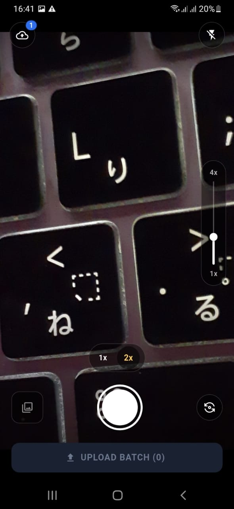
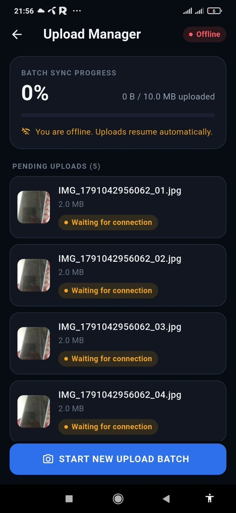
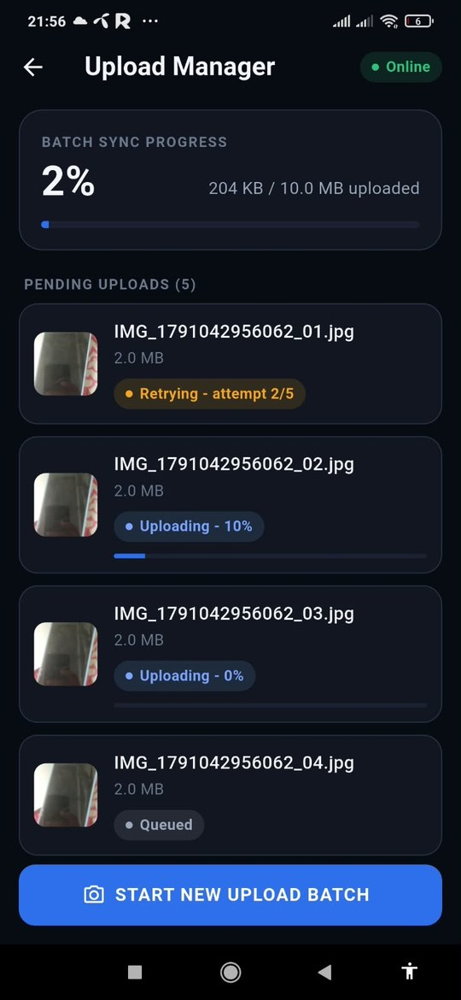
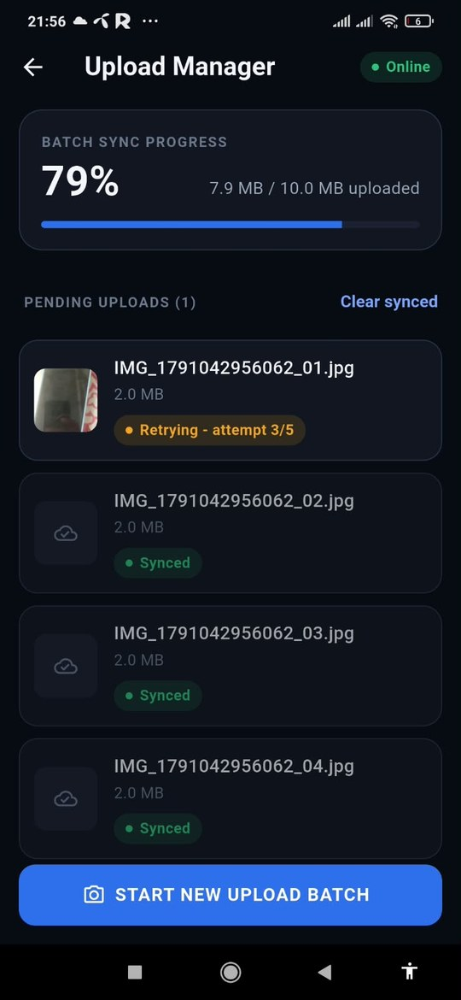
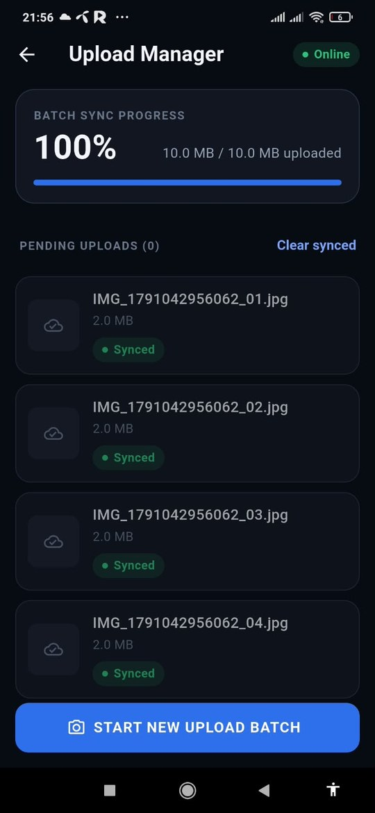
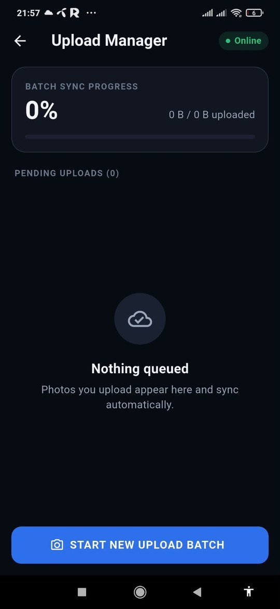

<p align="center">
  
</p>

<h1 align="center">SnapQueue</h1>

<p align="center"><i>Snap now, sync whenever the network lets you.</i></p>

Capture photos in batches and upload them reliably. Every photo goes into a
local queue first, so a weak or missing connection never loses work, and the
queue drains by itself once the network is back.

> Task 2 of the Senior App Developer assessment (Flutter).
> No backend was provided, so uploads go through `MockUploadGateway`, which
> refuses when offline and randomly drops ~30% of uploads to exercise the retry
> logic. A commented-out `HttpUploadGateway` shows the real implementation.

**Release APK:** [Download SnapQueue v1.0.0](https://github.com/rhrazib/snapqueue/releases/latest)

(Install it on a real Android 7.0+ phone; the camera needs hardware.)

## Features

- **CameraPreviewScreen**: pinch-to-zoom, vertical zoom slider, quick-zoom
  buttons (0.5x / 1x / 2x / 5x, shown only when the device exposes that zoom
  range, so 0.5x depends on the phone), tap-to-focus
  with a visual ring, flash modes, front/back switch, batch thumbnail + counter
- **Design system**: tokens in `core/theme` (colours, theme), glass-style camera
  controls over scrims, haptics + shutter flash, pending-count badge, portrait lock
- **Batches**: take several photos, press *Upload batch*, repeat
- **Upload Manager**: pending list, per-file and overall progress, states
  (queued / waiting for connection / retrying n/5 / uploading / synced / failed),
  online chip, retry failed, clear synced
- **Resilient sync**: WorkManager job with a "network connected" constraint and
  exponential backoff, plus a foreground coordinator that reacts to
  connectivity changes. Offline and low-bandwidth failures never discard a
  photo and never end in a terminal state: the UI shows "Retrying - attempt
  n/5", and after the fifth attempt the photo goes back to the queue for a new
  round, with a growing delay between rounds (20 s up to 5 min).
- **Cleanup**: once a photo is uploaded its local file (and empty batch folder)
  is deleted; the row stays in the list as "Synced" until cleared.

## Project Structure / Approaches

Clean Architecture, feature-first, with BLoC for state and `get_it` for DI.

```
lib/
  core/            error (Failure), network, sync (WorkManager, coordinator), DI
  features/
    upload_queue/
      domain/        entities, repository + gateway interfaces, use cases
      data/          drift database, photo storage, repository impl, mock gateway
      presentation/  UploadManagerBloc, UploadManagerPage
    camera/
      presentation/  CameraBloc, CameraPreviewScreen, widgets
```

Dependencies point inward: presentation -> domain <- data. The domain layer is
plain Dart (no Flutter, drift or camera imports).

- `CameraBloc`: camera lifecycle, zoom, focus, flash, flip, capture and the
  current batch. Pinch zoom uses `restartable()`, shutter/submit use
  `droppable()`. One-shot UI reactions (snackbar, navigation) are a
  `CameraEffect` in the state.
- `UploadManagerBloc`: listens to the drift queue stream and to connectivity.
- `SyncUploadQueue` (use case): the whole retry policy in one place; unit tested.
- **Drift** is the local store. Both the UI isolate and the WorkManager isolate
  open the DB with `shareAcrossIsolates: true`, so queue `watch()` streams
  update when the background worker writes progress.
- Rows are taken with an atomic `claim()` (conditional UPDATE), so the
  foreground sync and the background worker never upload the same file twice.
  Rows left "uploading" by a killed process are released after 2 minutes, and
  the sync keeps re-checking until they are.
- `SyncUploadQueue` re-reads the queue after every pass, and
  `SyncCoordinator.kick()` re-runs if it is called mid-sync, so a batch queued
  while another one is uploading is never left waiting.

### Sync flow

```
capture -> files moved to app storage + rows inserted (pending) -> WorkManager
one-off (network constraint) + foreground kick
  offline          -> row released, stays pending; resumes on connectivity event
  low bandwidth    -> row retrying (n/5), new round after 5, backoff (never terminal)
  file missing     -> failed (permanent)
  success          -> synced, local file deleted
```

"Stable connection" is interpreted as: the OS reports a validated network
(WorkManager `NetworkType.connected` / `connectivity_plus`), and each upload
attempt still has to succeed; an attempt that drops mid-way is simply retried.

Trade-off: `CameraController` sits in `CameraState` instead of behind a domain
interface, because the preview widget has to render it. Queueing logic still
goes through a use case.

### Known limitations

- Photos are saved into the app's storage when you press *Upload batch*. Until
  then the current batch only lives in memory (the files are in the camera
  cache), so killing the app before pressing the button discards that draft.
- The 0.5x button only appears on phones whose camera reports a zoom range below
  1x. Phones without an ultra-wide lens show 1x / 2x / 5x only.
- The API is mocked on purpose (`MockUploadGateway`); the real HTTP client is
  provided as commented-out code in `HttpUploadGateway`.

## Generative AI Usage

I used **Claude (Anthropic)** and **ChatGPT (OpenAI)** as pair-programming, debugging, and code-review assistants during development. AI tools were used to accelerate implementation, review edge cases, and audit the project against the assessment requirements. I remained responsible for the architecture, implementation decisions, testing, and final verification.

* **Architecture and implementation assistance:** Used AI tools to help with feature-first Clean Architecture, BLoC structure, Drift database setup, WorkManager integration, and related Flutter implementation details.
* **Assessment audit:** Provided the exact assessment requirements and asked the AI tools to trace the real end-to-end flow — capture → local queue → offline handling → retry → sync → cleanup — and identify concrete gaps.
* **Debugging and review:** Used AI to investigate implementation issues, review specific classes/functions, and suggest minimal, targeted fixes rather than rewriting unrelated parts of the project.

### Essential Prompts

1. *"Audit the project against the exact assessment requirements. Do NOT rewrite the whole project. For every issue, mention the exact file, class, or function. Trace the actual flow: Capture image → save locally → create batch → queue upload → no internet/API failure → persist pending state → connectivity restored → WorkManager → retry → success → mark synced → cleanup."*

2. *"Check whether the implementation really satisfies this requirement: if the API call fails due to low bandwidth or no internet, the images must remain in the local queue and retry automatically without user intervention."*

3. *"Complete the audit's must-fix and should-fix items with minimal changes. Do not rewrite unrelated parts of the project."*

### My Own Decisions and Verification

I personally made and verified the key technical decisions, including the architectural layering and trade-offs, the retry policy, and the behavior of the application on a physical Android device.

I also manually tested the critical sync scenarios, including:

* Airplane mode / no-internet upload
* Automatic retry after connectivity is restored
* Killing the app during an upload
* Queue recovery and subsequent synchronization

The AI-assisted audit helped identify and address several concrete issues, including:

* Re-checking the queue when a new batch arrives during an active sync
* Automatically retrying low-bandwidth failures
* Deleting local files after successful synchronization
* Atomic batch enqueue with rollback
* Preventing the submit race condition in `CameraBloc`


## How to Run

```bash
git clone https://github.com/rhrazib/SnapQueue.git
cd snapqueue
flutter pub get
flutter run                       # real device recommended (camera)
flutter build apk --release
```

Generated drift code (`app_database.g.dart`) is committed. If you change the
schema: `dart run build_runner build --delete-conflicting-outputs`.

Requires Flutter 3.38.4+ (Dart 3.11+) and Android 7.0+ (`minSdk = 24`,
required by the camera plugin). Android permissions are listed in
`docs/android_setup.md`.

### Release signing

`android/app/build.gradle.kts` signs release builds with the keystore described
in `android/keystore.properties` when that file exists (it is git-ignored, as is
the `.jks`). On a fresh clone it falls back to the debug key, so
`flutter build apk --release` works without any setup.

Tests: `flutter test`

To see the retry flow:

1. Enable airplane mode, take a batch, press *Upload batch*. Items show
   "Waiting for connection" and stay queued.
2. Disable airplane mode. Uploads start by themselves, with the app open or
   after you swipe it away (WorkManager runs the job when the network is back).
3. With the mock gateway ~30% of uploads also fail on purpose ("Retrying -
   attempt n/5") and succeed on a later attempt without any user action.
4. Kill the app mid-upload and reopen it: the interrupted item is released
   after at most 2 minutes and uploaded again.

Note: on some phones (Xiaomi, Oppo, Samsung power saving) the OS delays
background jobs of apps that are swiped away; that can slow the app-closed
retry by a few minutes.

## Screenshots

| Camera | Offline: waiting for connection | Back online: uploading + retry |
|---|---|---|
|  |  |  |
| Pinch / slider / 1x-2x presets, tap-to-focus ring | Nothing is lost while offline | Resumes by itself, failed attempts retry |

| Retrying (attempt n/5) | All synced | Queue cleared |
|---|---|---|
|  |  |  |
| Low-bandwidth failures retry on their own | Local files deleted after sync | Clear synced empties the list |
